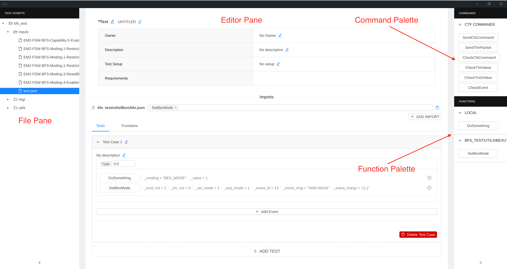
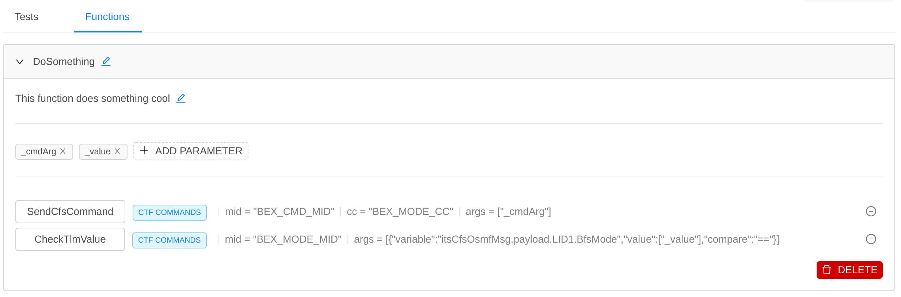
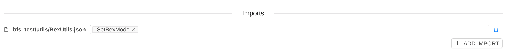
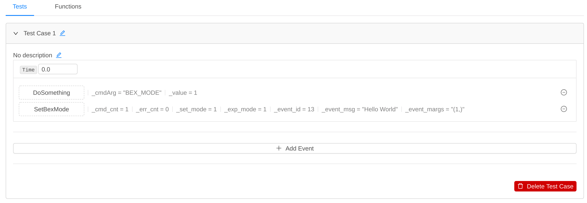

Table of Contents
=================

   * [Disclaimer](#disclaimer)
   * [Introduction](#introduction)
   * [Getting Started](#getting-started)
   * [Loading a workspace](#loading-a-workspace)
   * [Creating a new script](#creating-a-new-script)
   * [Building a test case](#building-a-test-case)
   * [Modifying an existing script](#modifying-an-existing-script)
   * [Creating functions](#creating-functions)
   * [Importing functions](#importing-functions)
   * [Calling Functions](#calling-functions)

# Disclaimer

**CTF editor is currently still in development**. This means it is possible for CTF editor to modify and save an invalidor broken script. Please make sure to **track all existing scripts using source control**. This will allow you to revert back to a previous version of scripts if needed. Please create issues to report any bugs encountered.

# Introduction

This guide will walk you through using the CTF editor to create, modify, and update existing CTF JSON scripts.

When saving a script from the editor, a new version of the JSON script is written with the new changes. You can switch back and forth between modifying JSON files manually and using the CTF editor.

# Getting Started

To launch the editor, make sure you are within the CTF environment. If not, run `source activate_ctf_env.sh` at the root directory of the CTF repo.

After activating the environment, run `./run_editor.sh` script to launch the editor.

###### Note -  The `run_editor` script serves as an alias to build/run the editor from the `tools/ctf_ui` directory. To launch the editor manually, navigate to the `ctf_ui` directory and execute `npm run prod`. This will launch an instance of the editor. 

###### Note - If  errors are seen related to the "chrome-sandbox" permissions, run the following commands
    sudo chown root /path/to/chrome-sandbox
    sudo chmod 4755 /path/to/chrome-sandbox

# Editor Components

The image below shows the UI components of the editor, specifically:

*  File Pane - Shows the directories and JSON script in the provided project workspace.
*  Editor Pane - Show the current script being edited
*  Command Palette - Contains all the commands that can be dragged into the current script
*  Function Palette - Contains all the functions that can be dragged into the current script.

# Loading a workspace

Click `File` -> `Open Workspace` to specify your workspace. The workspace includes the base path of JSON scripts, the path to a JSON file containing the available CTF commands, and a path to the CCDD exported message information in order to offer autocomplete fields. A workspace JSON file should be created for new projects. 

###### Note - Reference the default workspace `sample_editor_workspace.json` in the CTF repo as an example of the CTF Editor workspace file. The `sample_editor_workspace` can also be utilized assuming the CTF tool is installed in the tools directory of a cFS project.

# Creating a new script

To create a new test script, click `File` -> `New Test Script`. This will create an empty (unsaved) test script. You can modify any of the script header properties by clicking the `edit` icon. After modifying these fields, you can save the script by typing `ctrl + s` or clicking `File` -> `Save Test Script`. This will prompt you to choose a location and a name for your file.

# Building a test case

To start building your test case, click `+ Add Test`. This will create a collapsed test case with the name `Untitled Test`. The title can be modified, along with the test description. Remember to save your test case periodically so that you do not lose your work.

With the test case created, we can now add test instructions. To do that, drag any command from the top right `Commands` pane into the test case. After dropping a command into the test, click that command button to modify the command arguments. You'll notice that most argument fields will provide an Autocomplete functionality for field types CTF Editor knows (MIDs, CCs, Telemetry Variables, etc...). When finished with that test command, click anywhere to hide the arguments pane. Remember to save periodically!

# Modifying an existing script

To modify an existing script, simply choose the existing script from the left pane of CTF Editor. The script will be editable in the main editor pane, and any changes can be saved by typing `ctrl + s` or clicking `File` -> `Save Test Script`.

Note - it is recommended you run a `git diff` command to ensure that the changes introduced by CTF are in fact what you expect the changes to be.

# Creating functions

Functions allow you to reuse a sequence of commands across different test cases or test scripts. Functions can be defined by switching to the `Functions` tab.

A function definition allows you to define a set of parameters that can be used throughout the function scope. When calling a function, the caller will specify the arguments for that function call. The example below shows a function definition `DoSomething` which receives 2 parameters (`_cmdArg` and `_value`). Commands in that function can use those parameters wherever suitable.

# Importing functions

Functions can be imported from other JSON files. To import a function, simply click `+ Add Import` and select the JSON file that contains the function you want to use. Next, select the functions you would like to import from that file. The function will now be available in the bottom right `Functions` palette.

An example of importing the `SetBexMode` function from the `BexUtils.json` file is shown below.

# Calling Functions

To call a function within a test case (or within another function), simply drag the function from the function palette (bottom-right corner) into the event you want to call that function. Next, click the new function to specify its arguments. An example of 2 functions calls is shown below.

